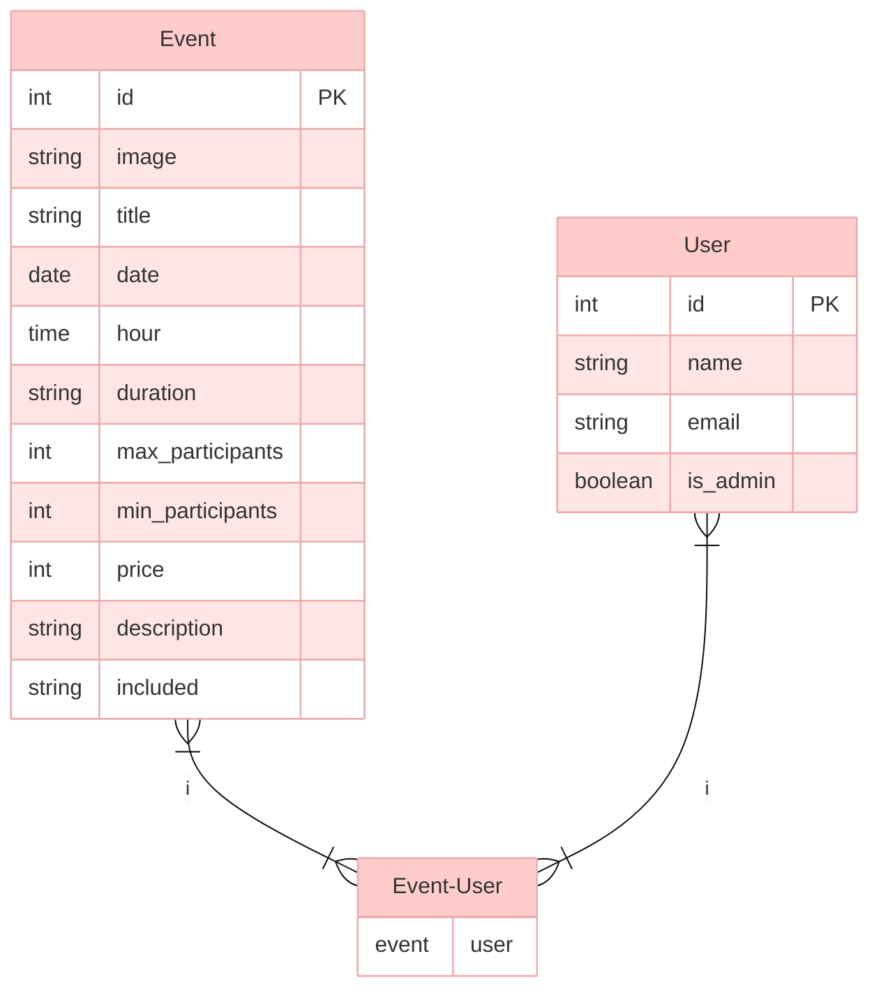

npm install

## Starting server
npm run dev

## Preview
php artisan serve

## Configuration
clone env.example and call it .env

generate key

```mermaid

%%{init: {'theme': 'base', 
'themeVariables': { 
    'primaryColor': '#ffcccc', 
    'edgeLabelBackground':'#ffffee', 
    'tertiaryColor': '#fff0f0',
    "actorTextColor": "#fff",
    "textColor": "#712E3D",
    "actorBorder": "blue"
    }}}%%
erDiagram
    User{
        int id PK
        string name
        string email
        boolean is_admin
            }
    
    Event }|--|{ Event-User : i
    User }|--|{ Event-User : i

    Event{
        int id PK
        string image
        string title
        date date
        time hour
        string duration
        int max_participants
        int min_participants
        int price 
        string description 
        string included 
    }
    Event-User{
        event user
    }

```
